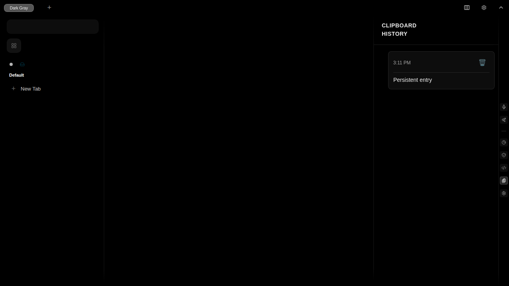

# Test Report: Persistence Across Page Refresh

**Generated**: 2025-11-19T15:11:38.877Z

**Total Steps**: 2

## User Story

As a user, I want my clipboard history to persist across page refreshes so I don't lose my data

### Acceptance Criteria

- Clipboard sidebar is visible and open
- Entry "Persistent entry" is stored in PouchDB
- Entry is displayed in the sidebar
- Page is about to be refreshed

---

## Step 1: Entry visible before refresh

Clipboard sidebar is open showing the entry "Persistent entry" before page refresh

### Expectations

- ✓ Sidebar displays clipboard history
- ✓ Entry is visible in the list
- ✓ Entry is stored in database

---

## Step 2: Entry persists after refresh

After page refresh, clipboard sidebar is reopened and the entry "Persistent entry" is still visible

### Expectations

- ✓ Entry survived page refresh
- ✓ Data persists in PouchDB
- ✓ Sidebar correctly loads persisted data
- ✓ UI shows the same entry as before refresh

