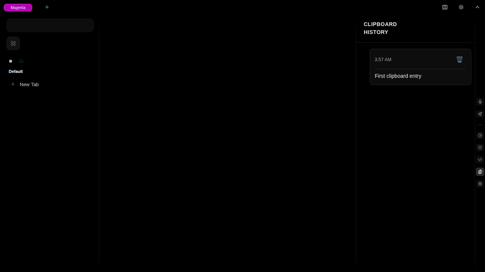
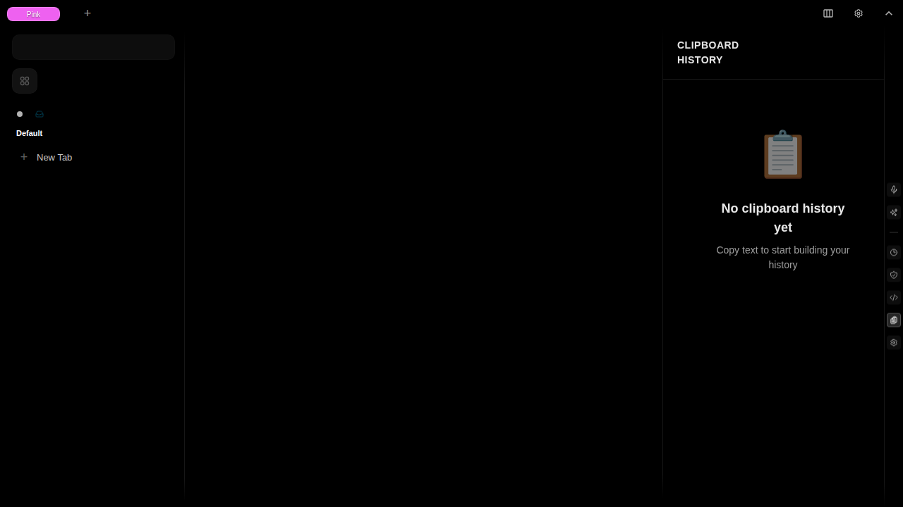
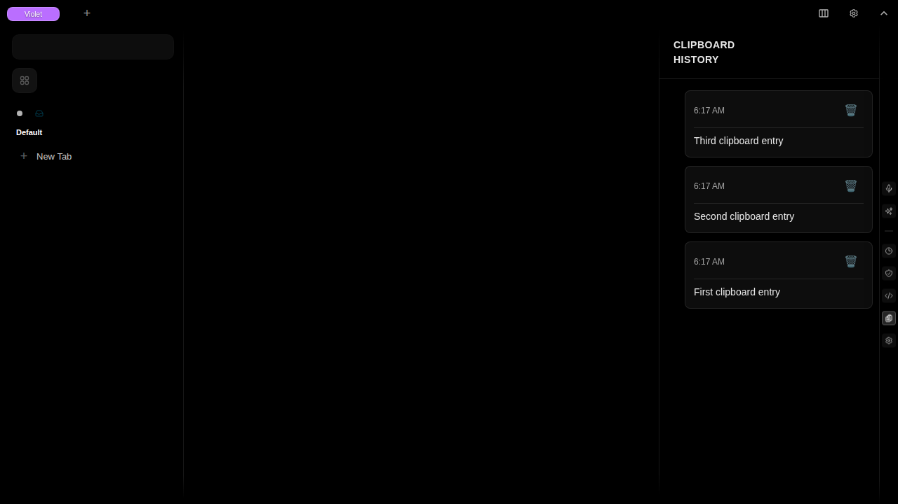
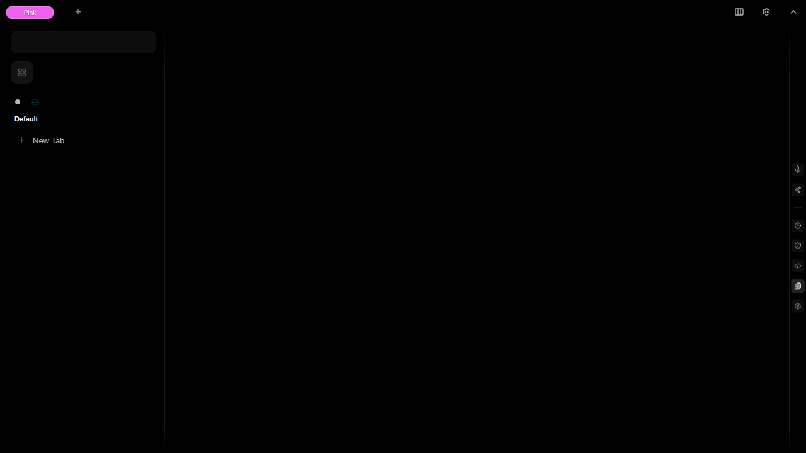

# Test Report: clipboard-history-copy-multiple-entries-and-verify-all-appear

**Generated**: 2025-11-19T02:23:36.845Z

**Total Steps**: 4

## User Story

As a user, I want to view my clipboard history so I can keep track of text I've copied

### Acceptance Criteria

- User can copy text and see it appear in clipboard history
- Clipboard history is accessible via sidebar
- Copied entries are stored in PouchDB
- Entries persist across page refreshes
- User can delete individual entries

---

## Step 1: First Entry Copied

First entry copied: "First clipboard entry"

### Expectations

- ✓ First entry captured by clipboard monitor

---

## Step 2: Second Entry Copied

Second entry copied: "Second clipboard entry"

### Expectations

- ✓ Second entry captured

---

## Step 3: Third Entry Copied

Third entry copied: "Third clipboard entry"

### Expectations

- ✓ Third entry captured

---

## Step 4: All Entries Visible

All three entries visible in clipboard history

### Expectations

- ✓ Three entries are displayed
- ✓ Entries are in chronological order (newest first)
- ✓ All text content is visible

