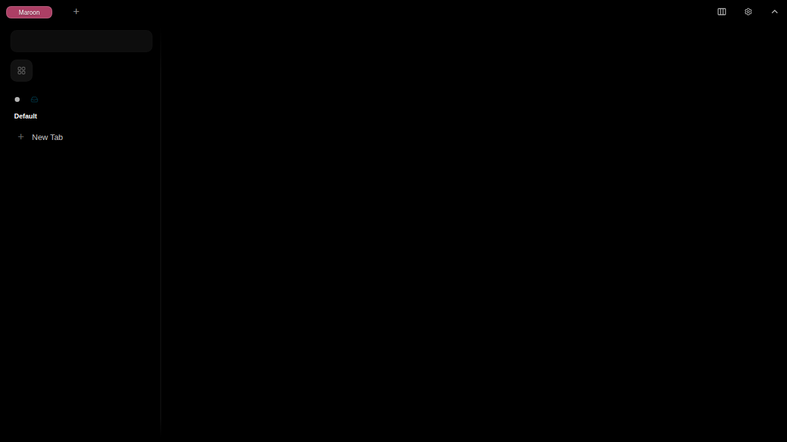
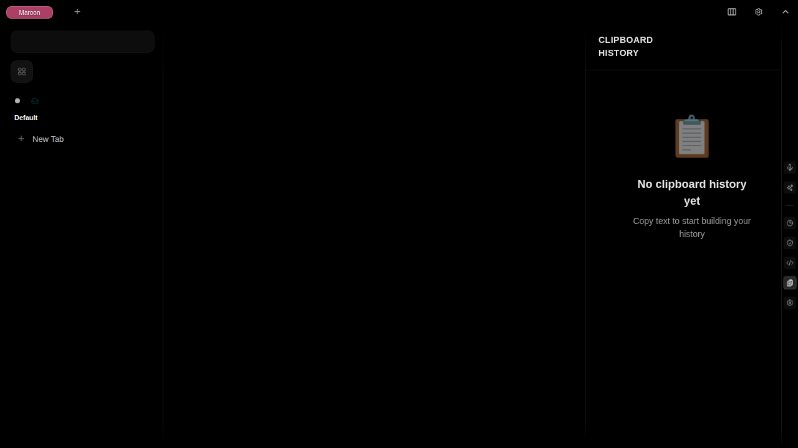
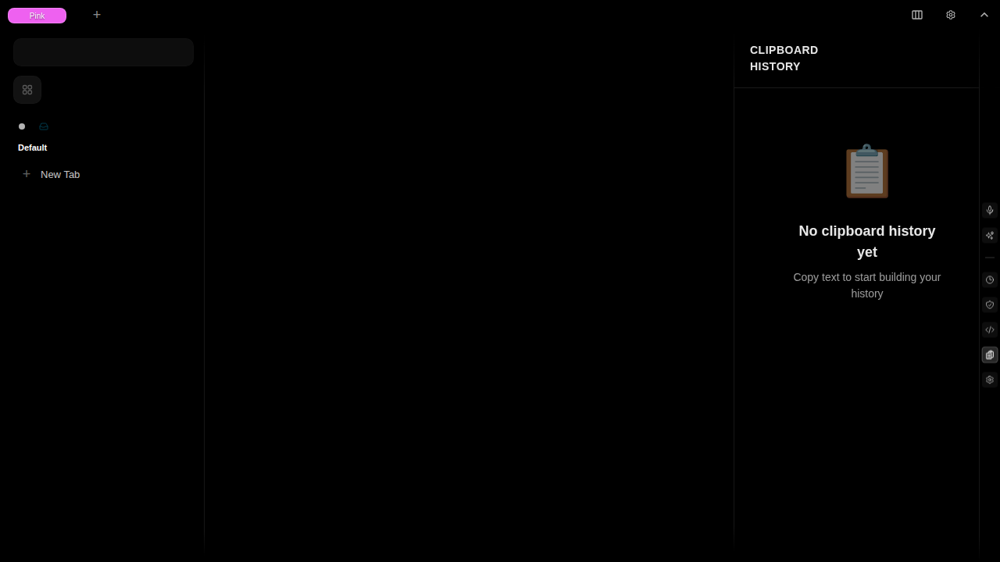

# Test Report: clipboard-history-copy-text-and-view-in-clipboard-history

**Generated**: 2025-11-19T01:35:10.138Z

**Total Steps**: 4

## User Story

As a user, I want to view my clipboard history so I can keep track of text I've copied

### Acceptance Criteria

- User can copy text and see it appear in clipboard history
- Clipboard history is accessible via sidebar
- Copied entries are stored in PouchDB
- Entries persist across page refreshes
- User can delete individual entries

---

## Step 1: Initial State

Application loaded with default view showing Darc browser interface

### Expectations

- ✓ Application is fully loaded
- ✓ Tab sidebar visible on left
- ✓ Right sidebar buttons visible
- ✓ No clipboard history sidebar open yet

---

## Step 2: Text Copied

Copied text: "Hello, this is a test clipboard entry!" to clipboard

### Expectations

- ✓ Text was copied to clipboard
- ✓ Clipboard monitor captured the copy event
- ✓ Entry stored in PouchDB

---

## Step 3: Clipboard History Sidebar Opened

Clicked Clipboard History button to open the sidebar

### Expectations

- ✓ Sidebar is visible on the right side
- ✓ Sidebar shows "Clipboard History" title
- ✓ Copied text is displayed in the list

---

## Step 4: Entry Visible in History

Clipboard entry is visible with all details

### Expectations

- ✓ Entry shows the copied text
- ✓ Entry has a timestamp
- ✓ Entry has a delete button
- ✓ Entry content matches copied text

