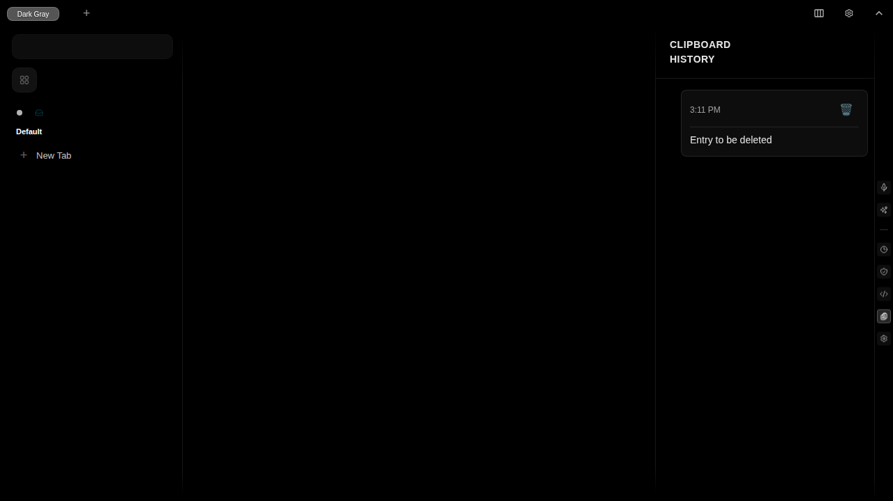
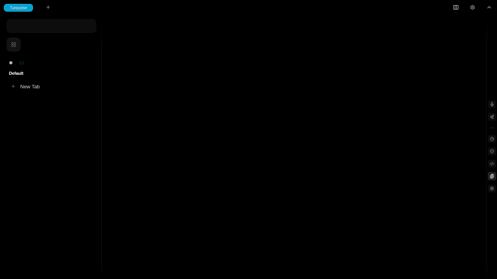

# Test Report: clipboard-history-delete-clipboard-entry

**Generated**: 2025-11-19T03:04:31.816Z

**Total Steps**: 2

## User Story

As a user, I want to view my clipboard history so I can keep track of text I've copied

### Acceptance Criteria

- User can copy text and see it appear in clipboard history
- Clipboard history is accessible via sidebar
- Copied entries are stored in PouchDB
- Entries persist across page refreshes
- User can delete individual entries

---

## Step 1: Before Deletion

Clipboard history showing entries before deletion

### Expectations

- ✓ Multiple entries visible
- ✓ Each entry has a delete button

---

## Step 2: After Deletion

Entry deleted from clipboard history

### Expectations

- ✓ Entry removed from UI
- ✓ Entry count decreased
- ✓ Remaining entries still visible

