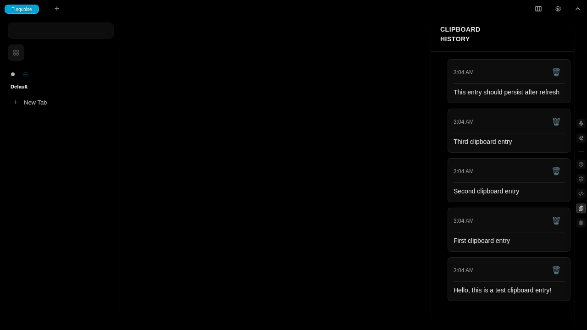

# Test Report: clipboard-history-persistence-across-page-refresh

**Generated**: 2025-11-19T03:04:40.077Z

**Total Steps**: 2

## User Story

As a user, I want to view my clipboard history so I can keep track of text I've copied

### Acceptance Criteria

- User can copy text and see it appear in clipboard history
- Clipboard history is accessible via sidebar
- Copied entries are stored in PouchDB
- Entries persist across page refreshes
- User can delete individual entries

---

## Step 1: Before Page Refresh

Entry created: "This entry should persist after refresh"

### Expectations

- ✓ Entry visible in clipboard history

---

## Step 2: After Page Refresh

Page refreshed and clipboard history reopened

### Expectations

- ✓ Entry persisted across page refresh
- ✓ Entry still visible in clipboard history
- ✓ PouchDB storage working correctly

